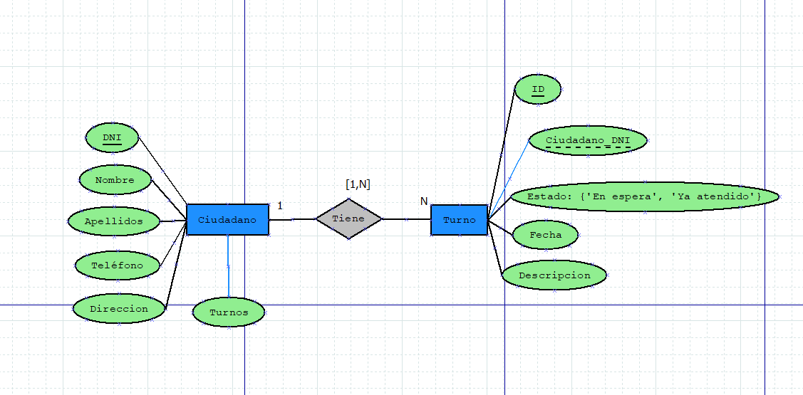
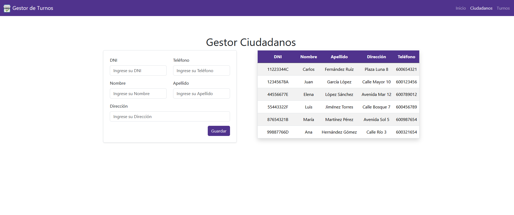
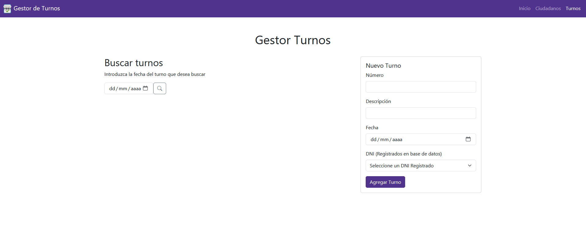
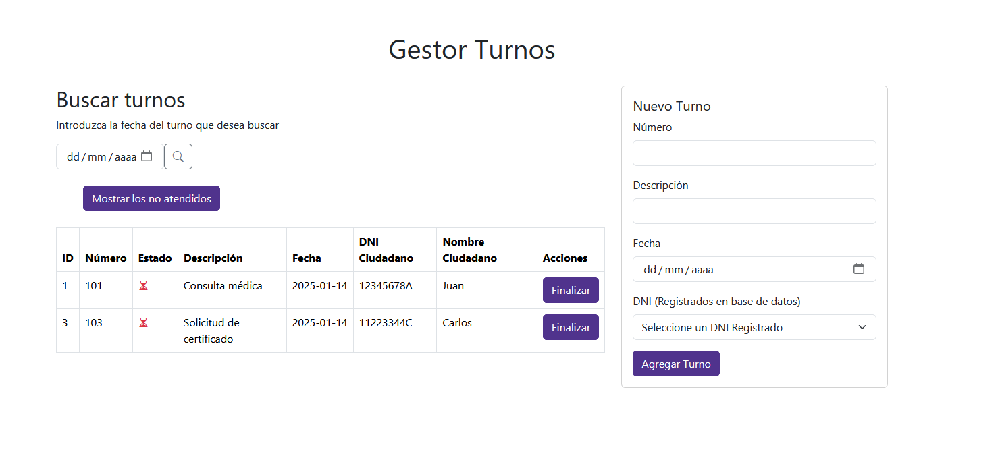
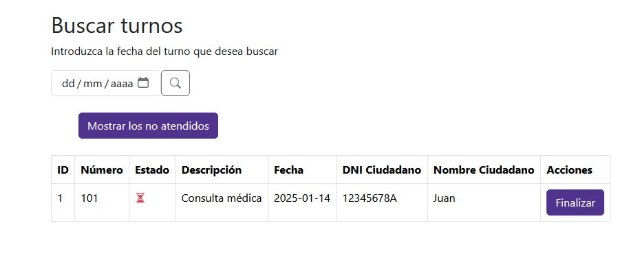

# RodriguezLaura_pruebatec2
Prueba tecnica Java Avanzando HACKABOSS bootcamp por Laura Rodriguez Contador

## Como ejecutar el proyecto
1. Clonar el proyecto
2. Abrir el proyecto en un IDE (Eclipse, IntelliJ, Netbeans)
3. Ejecutar el proyecto

## Tecnologias utilizadas

 - Java 
 - JPA
 - JSP
 - Servlets
 - MySQL

## Estructura del proyecto

El proyecto esta dividido en 3 capas:

1. **Capa de presentación**: Contiene los JSP y los Servlets
2. **Capa de negocio**: Contiene las clases de negocio
3. **Capa de datos**: Contiene las clases de acceso a datos

## Diagrama de base de datos 

## Funcionalidades

Al acceder al la aplicación mostrará una menu de inicio de presesentación , donde se ha estructurado en forma de SPA (Single Page Application) , donde cargaremos dinamicamente el contenido de cada sección.

Tenemos un menú de navegación con las siguientes opciones:

- Ciudadanos:

Este contiene un formulario para registrar un nuevo ciudadano, y una tabla con la lista de ciudadanos registrados.

- Turnos:

Este contiene un formulario para registrar un nuevo turno , que por defecto siempre se crearan sin finalizar, y un buscador por fecha para filtrar los turnos registrados.

Una vez filtrados podremos ver el estado del turno y el ciudadano al que pertenece.
Ademas podemos finalizar el turno en la seccion de Acciones.

Al finalizar el turno cambiara su estado a "Finalizado" y no podra ser modificado.

Además al buscar en un dia, si tenemos varios turnos registrados, tendremos acceso a un boton para mostrar solo los que no han sido atendidos.

